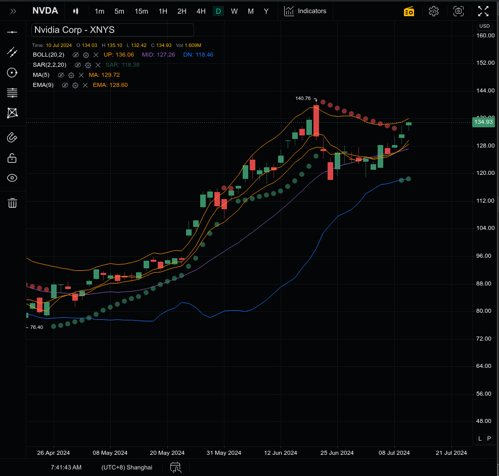
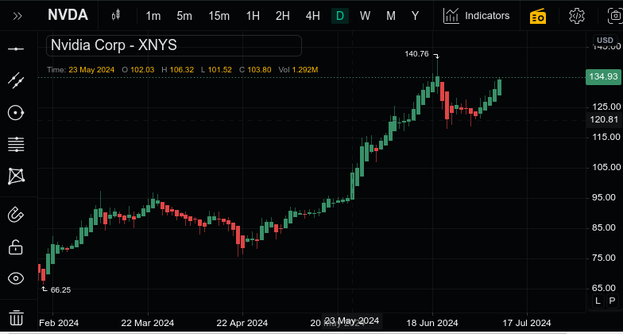
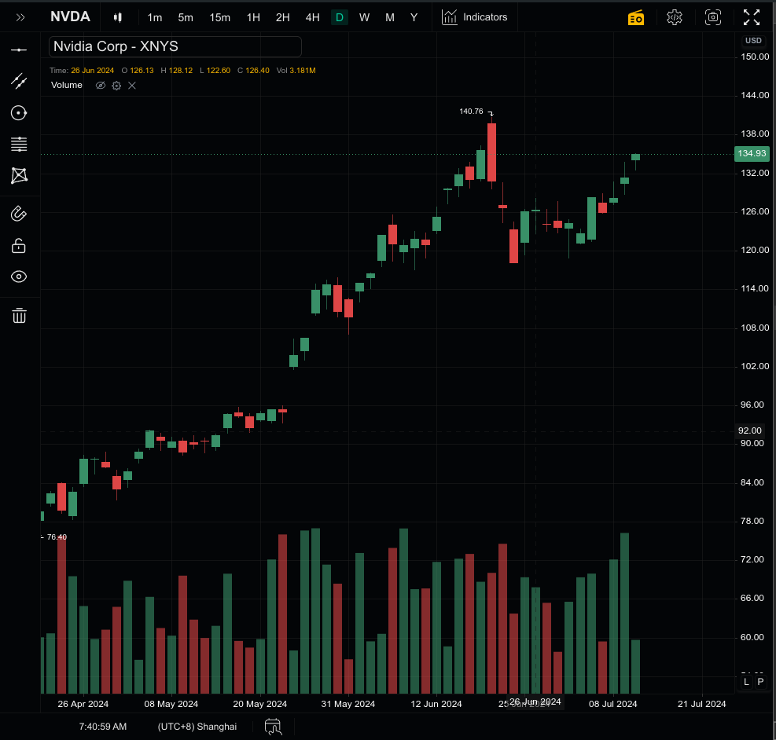
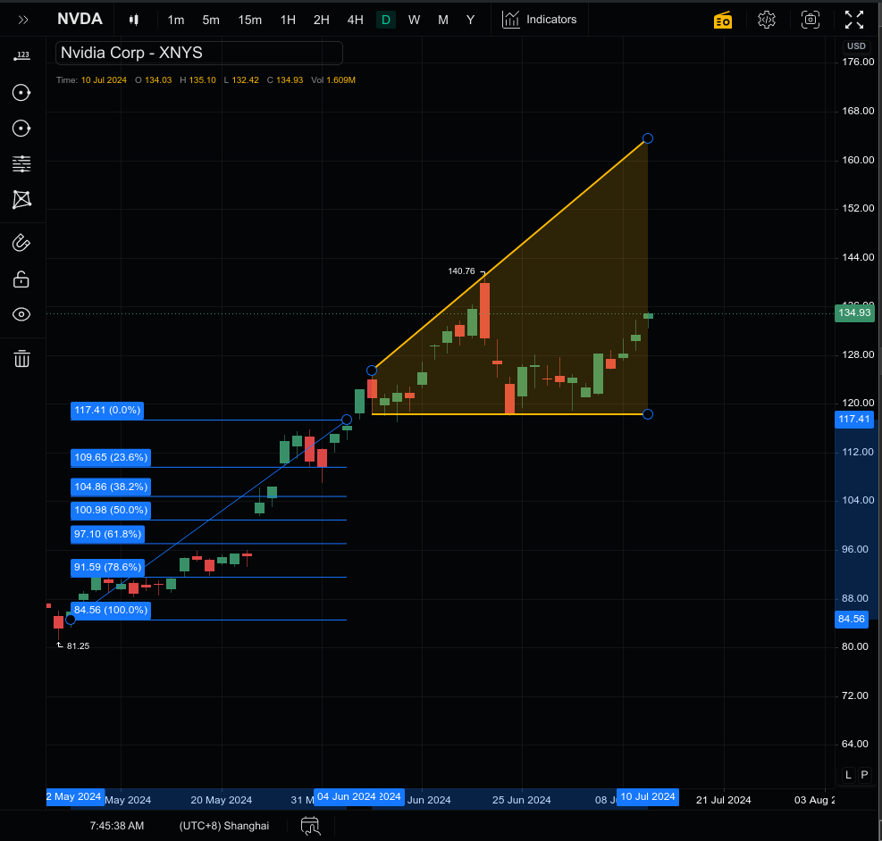
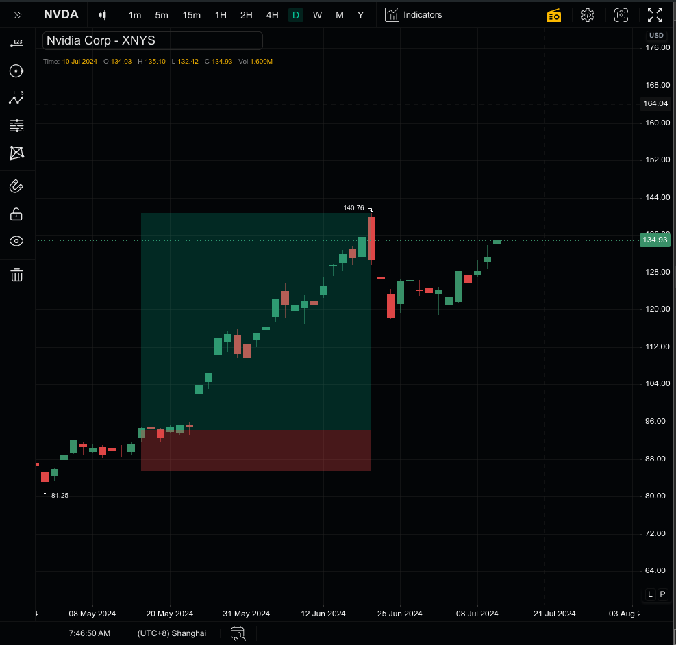
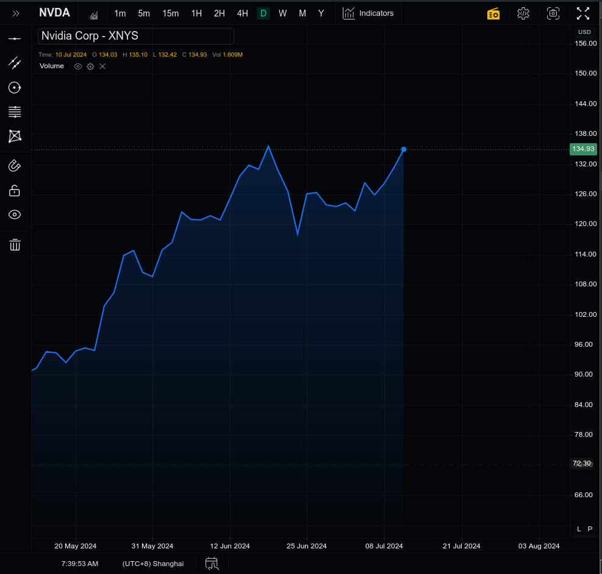
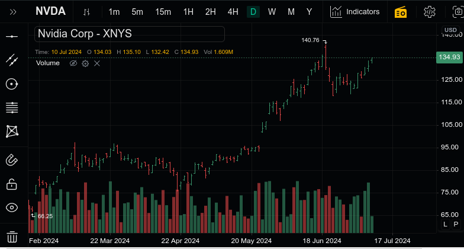
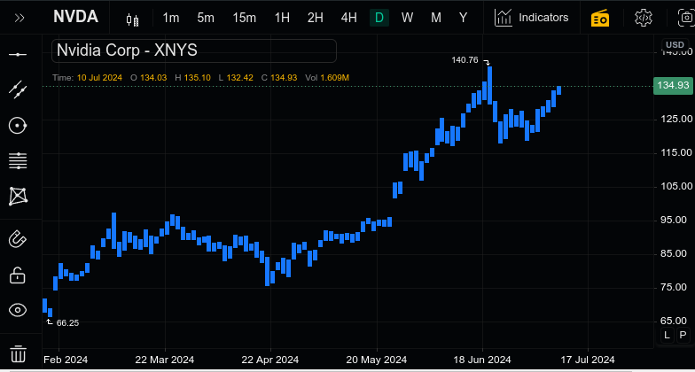
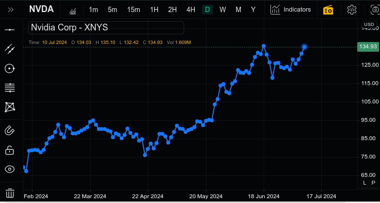

# Equicharts

Equicharts is a high-performance, open-source stock charting library built entirely with pure TypeScript. Designed with speed and efficiency in mind, it operates with no external dependencies, ensuring fast rendering and smooth interactions for your financial data visualizations.

This library uses [kline charts](https://github.com/liihuu/klineChart) as core with lots of customizations, which is licensed under the Apache License 2.0.

## Features

- **Pure TypeScript:** Written from the ground up in pure TypeScript for type safety and modern JavaScript compatibility.
- **No Dependencies:** Zero external dependencies mean fewer security risks and optimal performance.
- **High Performance:** Efficient rendering and smooth interactions even with large datasets.
- **Customizable Charts:** Easily customizable chart types including candlestick, line, bar, and more.
- **Interactive Tools:** A suite of interactive tools for detailed analysis, including zoom, pan, and annotation capabilities.
- **Responsive Design:** Adaptive layout for seamless use across devices and screen sizes.
- **Extensible Architecture:** Designed for easy integration and extension to fit your specific needs.

# Charting Platform

---

### Candlestick Chart with Indicators

### Heikin-Ashi Chart with Overlays

### Line Chart with Volume Indicator

### Area Chart with Trendlines

### Customizable Drawing Tools

---

### Thumbnail Gallery

  
  
  
  
  

